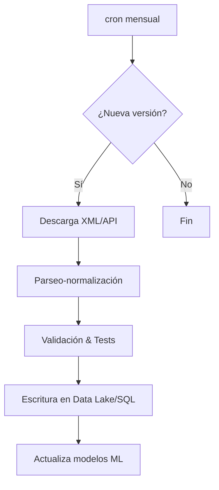

A continuación encontrarás una guía paso a paso—con ejemplos de código en Python—para extraer y mantener actualizada la información sobre enfermedades raras disponible en Orphanet/Orphadata. Los ejemplos cubren los tres canales de acceso principales (ficheros masivos XML/CSV, API REST y endpoints SPARQL) e incluyen recomendaciones de versión, validación y buenas prácticas de automatización.

## 1. Panorama de los recursos de Orphanet

Orphanet distribuye sus datos de forma estructurada a través de Orphadata:

| Canal                                                                                                                       | Contenido principal                                                                      | Frecuencia de actualización                            |                                                                    |
| --------------------------------------------------------------------------------------------------------------------------- | ---------------------------------------------------------------------------------------- | ------------------------------------------------------ | ------------------------------------------------------------------ |
| **Ficheros “free products”** (`product1`, `product3`, `product4`, `product6`, `product7`, `product9_prev`, `product9_ages`) | Nomenclatura, alineaciones, genes, fenotipos, epidemiología, historia natural            | Mensual, según *README* del repositorio API\_Orphadata | ([github.com][1])                                                  |
| **API REST Orphadata**                                                                                                      | Los mismos conjuntos anteriores vía peticiones HTTP autenticadas                         | Mensual                                                | ([api.orphadata.com][2], [orphanetapi.developer.azure-api.net][3]) |
| **Ontologías ORDO/HOOM + SPARQL**                                                                                           | ORDO (vocabulario de enfermedades raras) y HOOM (anotaciones fenotípicas con frecuencia) | Semestral (junio-diciembre)                            | ([orphadata.com][4], [orphadata.com][5], [orphadata.com][6])       |

La producción y control de calidad siguen Procedimientos Normalizados de Trabajo publicados por Orphanet, lo que garantiza trazabilidad y versiones estables ([orpha.net][7]).

## 2. Preparar el entorno Python

```bash
python -m venv orpha_env
source orpha_env/bin/activate
pip install requests pandas lxml xmltodict rdflib SPARQLWrapper owlready2
```

`owlready2 >= 0.48` es compatible con OWL 2.0 y permite cargar ORDO localmente o desde URL ([pypi.org][8]).

## 3. Descarga masiva de “free products” (XML → pandas)

```python
import requests, zipfile, io, xmltodict, pandas as pd

def get_product(product_id="product1"):
    meta_url = f"http://www.orphadata.org/cgi-bin/free_{product_id}_cross_xml.json"
    meta = requests.get(meta_url, timeout=30).json()           # URL final y fecha
    url_zip = meta["product_file"]
    z = zipfile.ZipFile(io.BytesIO(requests.get(url_zip).content))
    xml_file = [n for n in z.namelist() if n.endswith(".xml")][0]
    data = xmltodict.parse(z.read(xml_file))
    return data, meta["date"]          # ‘date’ ~ última actualización

data, version = get_product("product1")  # Enfermedades + alineaciones
```

La estructura XML varía por producto; conviene normalizar cada bloque (p. ej. enfermedades, sinónimos, códigos externos) en dataframes para análisis posterior. Los metadatos JSON incluyen la fecha de publicación que puedes almacenar como control de versión ([github.com][1], [orphadata.com][9]).

### Validación rápida

* Compara el campo `meta["date"]` con la versión previa almacenada.
* Aplica esquemas XSD facilitados en los documentos de referencia para asegurar integridad ([orphadata.com][10]).

## 4. Consumo de la API REST Orphadata

La API pública requiere registro (token OAuth2) y expone endpoints como:

```
GET https://api.orphadata.com/rare-diseases?search=Marfan
Authorization: Bearer <TOKEN>
```

Ejemplo:

```python
import os, requests, pandas as pd

token = os.getenv("ORPHA_TOKEN")
headers = {"Authorization": f"Bearer {token}"}
resp = requests.get("https://api.orphadata.com/rare-diseases",
                    headers=headers, params={"search":"Marfan"})
df = pd.json_normalize(resp.json()["results"])
```

La API devuelve paginado JSON; incluye campos `OrphaCode`, `Name`, `GeneAssociations`, etc.; ideal para consultas ad-hoc o integración en aplicaciones clínicas ([api.orphadata.com][2], [orphanetapi.developer.azure-api.net][3]).

**Límites**: 1 000 req/día y máx. 100 registros/página en el plan gratuito; la documentación completa se publica con OpenAPI v3 ([orphanetapi.developer.azure-api.net][11]).

## 5. Consultas semánticas vía SPARQL (ORDO/HOOM)

Cuando se necesitan relaciones ricas (p. ej. “genes asociados a >10 trastornos”):

```python
from SPARQLWrapper import SPARQLWrapper, JSON

sparql = SPARQLWrapper("https://www.orphadata.com/sparql-ordo")  # endpoint ORDO
query = """
PREFIX ordo:<http://www.orpha.net/ORDO/>
PREFIX rdfs:<http://www.w3.org/2000/01/rdf-schema#>
SELECT ?gene ?geneLabel (COUNT(?d) AS ?n_disorders)
WHERE {
  ?gene rdfs:subClassOf ordo:Orphanet_C010 .
  ?rel owl:someValuesFrom ?d .
  ?gene rdfs:label ?geneLabel .
}
GROUP BY ?gene ?geneLabel
HAVING (?n_disorders > 10)
ORDER BY DESC(?n_disorders)
LIMIT 20
"""
sparql.setQuery(query)
sparql.setReturnFormat(JSON)
results = sparql.query().convert()
```

Los endpoints están en fase beta: usa `retry` y caché local para producción ([orphadata.com][5], [orphadata.com][6]).

## 6. Carga local de ORDO para razonamiento

```python
from owlready2 import get_ontology

onto = get_ontology(
  "http://www.orphadata.com/ontologies/ORDO_4.2.owl").load()
print(len(list(onto.classes())))
```

Owlready2 permite inferir jerarquías y validar integridad (`sync_reasoner()`) ([owlready2.readthedocs.io][12]). Para volver a cargar sólo si hay versión más reciente:

```python
onto.load(reload_if_newer = True)
```

Esta lógica es útil en pipelines de actualización periódicos.

## 7. Automatización y ciclo de vida de datos

1. **Versionado** – Guarda los ficheros originales y la fecha del metadato; etiqueta tus tablas con el número de versión/fecha.
2. **Programación** – Usa `cron`, Airflow o Prefect para:

   * comprobar nuevas versiones cada mes (free products/API) y cada semestre (ORDO/HOOM).
   * regenerar tus modelos/indicadores sólo si hay cambios.
3. **Pruebas** – Esquemas XSD para XML y `jsonschema` para API; unit-tests sobre parsers.
4. **Ética y cumplimiento** – Los datasets no contienen PII, pero cualquier unión con bases clínicas locales sí podría revelarla; aplica seudonimización y gobernanza de accesos.

## 8. Ejemplo de flujo mínimo reproducible



## 9. Recursos adicionales y mejores prácticas

* Plantillas de consultas SPARQL federadas para integrar Orphanet con UniProt, HPO, etc. (catálogo ELIXIR) ([github.com][13]).
* Ejemplos de paquetes Python de alto nivel (p. ej. ODAMNet) que combinan Orphadata con datos ambientales para estudios multi-ómicas ([sciencedirect.com][14]).
* Trabajos recientes de QA sobre la ontología (detección de relaciones “is-a” faltantes) para mejorar la consistencia antes de explotarla en producción ([pmc.ncbi.nlm.nih.gov][15]).
* Documento “What is ORDO v 4.2” (jun-2025) para conocer la estructura de la ontología y los cambios de versión ([orphadata.com][16]).

Con esta arquitectura tendrás un pipeline robusto y auditable para explotar datos de enfermedades raras, manteniendo la base siempre actualizada y trazable.

[1]: https://github.com/Orphanet/API_Orphadata "GitHub - Orphanet/API_Orphadata"
[2]: https://api.orphadata.com/?utm_source=chatgpt.com "API Orphadata"
[3]: https://orphanetapi.developer.azure-api.net/ "Home - Microsoft Azure API Management - developer portal"
[4]: https://www.orphadata.com/_ontologies/?utm_source=chatgpt.com "_Ontologies – Orphadata"
[5]: https://www.orphadata.com/ordo-sparql-endpoint/?utm_source=chatgpt.com "ORDO SPARQL Endpoint - Orphadata"
[6]: https://www.orphadata.com/hoom-sparql-endpoint/?utm_source=chatgpt.com "HOOM SPARQL Endpoint - Orphadata"
[7]: https://www.orpha.net/pdfs/orphacom/special/eproc_SOPs.pdf?utm_source=chatgpt.com "[PDF] Orphanet Standard Operating Procedures"
[8]: https://pypi.org/project/owlready2/?utm_source=chatgpt.com "owlready2 - PyPI"
[9]: https://www.orphadata.com/orphanet-scientific-knowledge-files/?utm_source=chatgpt.com "Orphanet Scientific Knowledge Files - Orphadata"
[10]: https://www.orphadata.com/?utm_source=chatgpt.com "Orphadata – Orphanet datasets"
[11]: https://orphanetapi.developer.azure-api.net/?utm_source=chatgpt.com "Home - Microsoft Azure API Management - developer portal"
[12]: https://owlready2.readthedocs.io/en/latest/onto.html?utm_source=chatgpt.com "Managing ontologies — Owlready2 0.48 documentation"
[13]: https://github.com/elixir-europe/BioHackathon/blob/master/interoperability/Development%20of%20a%20catalog%20of%20federated%20SPARQL%20queries%20in%20the%20field%20of%20Rare%20Diseases/README.md?utm_source=chatgpt.com "Development of a catalog of federated SPARQL queries in the field ..."
[14]: https://www.sciencedirect.com/science/article/pii/S2352711024000724?utm_source=chatgpt.com "ODAMNet: A Python package to identify molecular relationships ..."
[15]: https://pmc.ncbi.nlm.nih.gov/articles/PMC9918376/?utm_source=chatgpt.com "Identifying Missing IS-A Relations in Orphanet Rare Disease Ontology"
[16]: https://www.orphadata.com/docs/WhatIsORDO.pdf?utm_source=chatgpt.com "[PDF] WHAT IS THE ORPHANET RARE DISEASE ONTOLOGY (ORDO)?"
